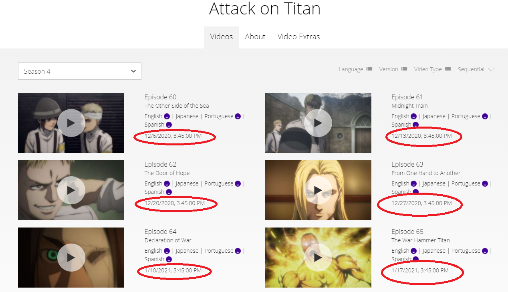

# FunimationDates
FunimationDates is a browser extension which adds Aired Date/Date Added information to a Show's Homepage on Funimation.com.

## Availability and Usage
This extension is not currently available in any Extension/Add-on Store and therefore has to be loaded as an unpacked add-on. You should never install any extension that you do not trust; be sure to review the extension (it's extremely basic) and understand what it does before you choose to install. This section will be updated with distribution links once this extension is available for installation through official channels.

If you do not know how to install an unpacked extension, the quickest solution is to do a web search for the steps needed for your specific browser. Generally, on the extensions/add-on page there will be a checkbox/toggle to allow Developer Mode (or a similar setting) at which point a button will appear with a label similar to "Load an unpacked extension".

## Functionality
When the homepage loads episodes it makes a request to Funimation's private API for episode information and stores it. The dates added by this extension are taken directly from that data: this extension makes no API calls of any kind and does no validation or manipulation of the dates aside from formatting them using Date.toLocaleString.